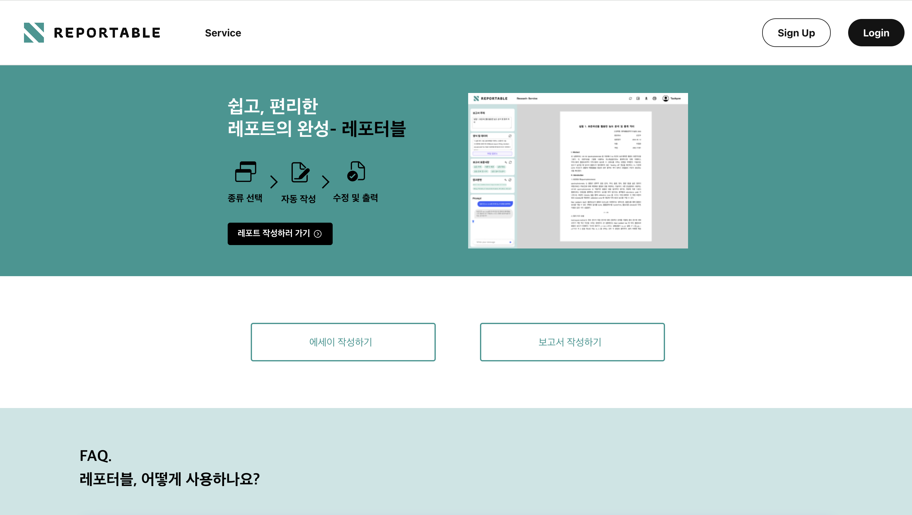
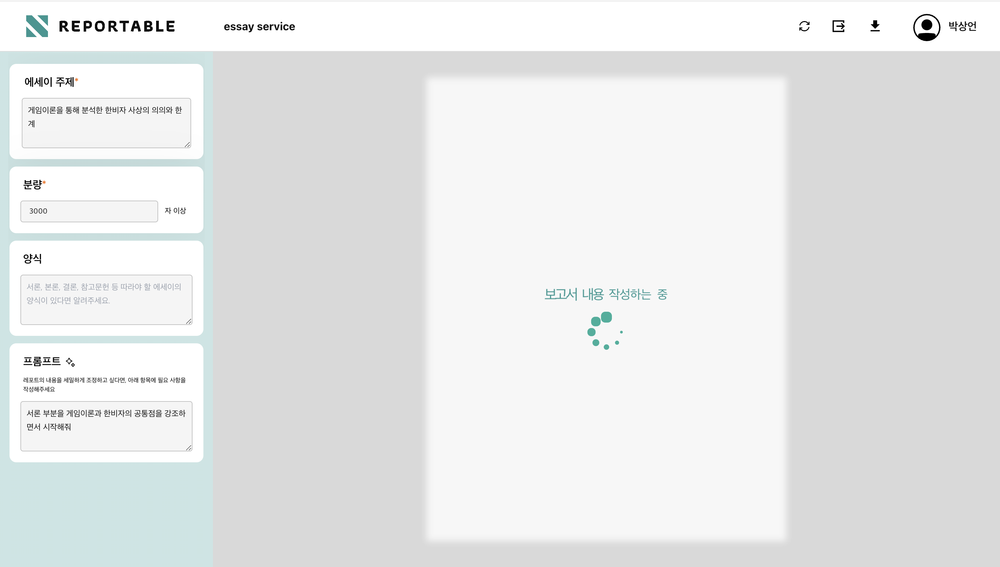
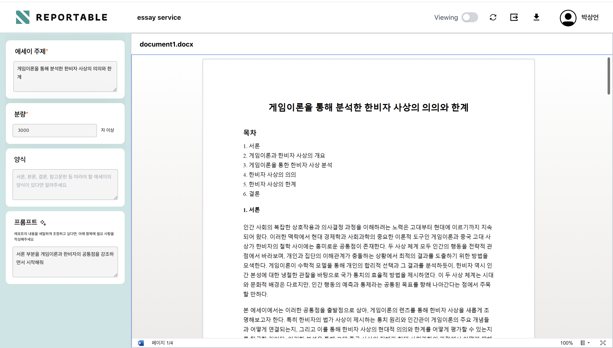
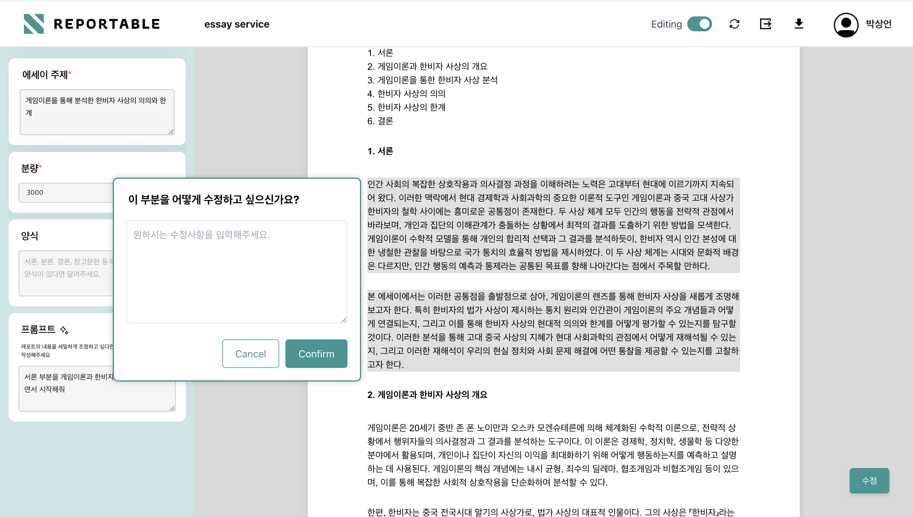
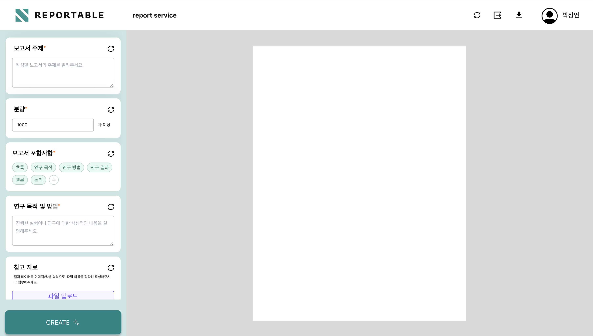
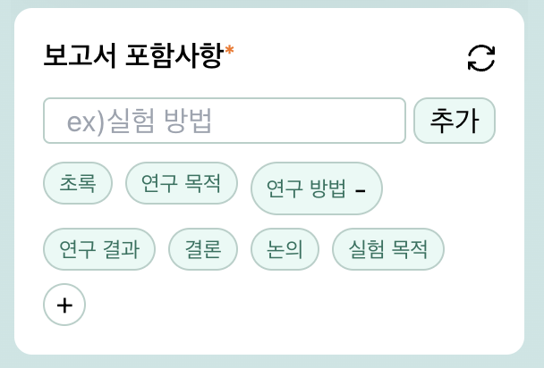
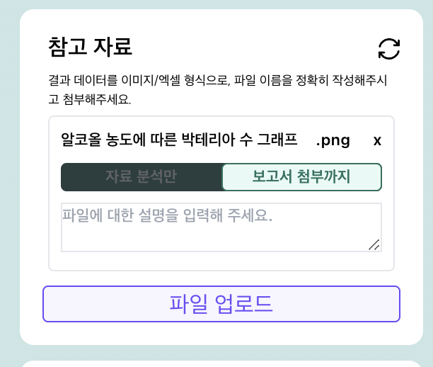
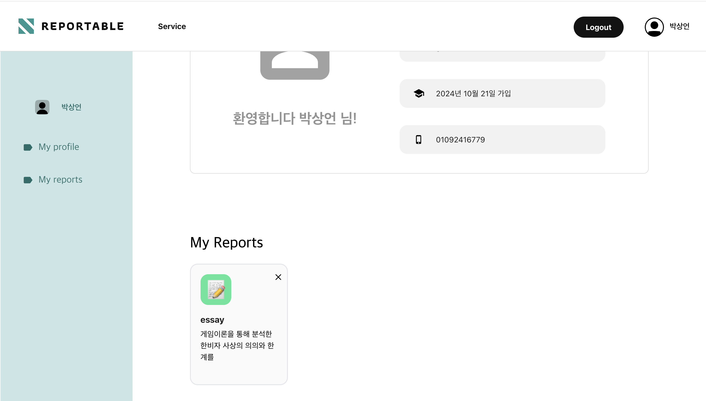

# Reportable

### 생성형 AI 기반 레포트 작성 서비스

## Introduction

Reportable은 LLM(Anthropic API)을 이용하여 사용자가 요구하는 조건에 맞는 학술보고서를 작성해주는 서비스 플랫폼입니다. Reportable은 반복되는 문서작업에 피로감을 느끼는 대학생들과 직장인들에게 효율적이고 정확한 보고서 작성 도구를 제공합니다. 사용자는 간단한 입력을 통해 원하는 주제, 분량, 형식 등을 설정할 수 있으며, 인공지능이 이를 바탕으로 고품질의 맞춤형 보고서를 생성합니다.
*실제 서비스 이용을 위해서는 .env 파일에 환경변수들을 설정해주어야 함

### Reportable의 차별점

**1. 맞춤형 보고서 작성에 특화**  
Reportable은 사용자 맞춤형 보고서를 생성하는 데 중점을 두고 있어, 개인화된 요구 사항을 충족시킬 수 있습니다. 
**2. 특정 양식에 얽매이지 않음**  
Reportable은 생성 모델을 사용하여 고품질의 자연스러운 문서를 작성하기 때문에 유연하고 다양한 요구를 충족시킬 수 있습니다. 
**3. 효율성과 편의성 제공**  
Reportable은 간단한 입력과 편리한 GUI를 통해 간단하게 고품질의 보고서를 작성해주기 때문에 시간과 노력을 절약할 수 있습니다.

## Reportable은 어떻게 사용하나요?

Reportable에서 작성할 수 있는 보고서의 유형은 essay와 research report 두 가지 종류로 나뉩니다. essay는 개인의 주관적인 생각과 논지를 중심으로 특정 주제에 대해 논리적으로 서술하는 것에 초점이 맞춰져 있습니다. 연구보고서는 좀 더 체계적이고 형식적인 양식 하에서 특정 주제에 대한 연구 결과를 객관적으로 보고하는 형태로, 사용자가 제공한 연구 결과를 바탕으로 명확한 답변을 제공하는 것에 초점이 맞춰져 있습니다.

### 회원가입

회원가입을 위해서는 이메일 인증이 필요하고 이름/비밀번호/전화번호 등을 추가로 입력해야 합니다

### 로그인

로그인 시에는 이메일 주소와 비밀번호를 입력해야 하며 구글과 카카오(추가예정)을 통한 간편로그인이 가능합니다.

### Essay 작성하기

Reportable의 홈페이지에서 essay 작성페이지로 접근할 수 있습니다.

 **초기 입력**  

에세이를 작성하기 위해서는 주제, 분량, 양식을 입력해야 하며 프롬프트를 이용해 추가적인 요구사항을 전달할 수 있습니다. 주제와 분량은 필수적으로 입력해야 합니다

Input box 상단의 새로고침 번튼을 누르면 이전의 입력내용이 초기화됩니다.

 **추가 질문** 

에세이의 경우 사용자의 의도에 초점을 맞추기 위해 AI가 추가 질문을 생성해 사용자에게 물어볼 수도 있습니다. 답변은 사용자의 자유이지만 추가질문에 대한 대답을 제공할 경우 더욱 양질의 보고서를 생성할 수 있습니다.

 **로딩** 

Reportable은 Anthropic API를 이용해 문서를 생성하고 이를 문서 뷰어로 제공하기 때문에 report를 작성하는 데에 1~2분 정도의 시간이 소유될 수 있습니다.

 **결과 페이지** 

완성된 보고서는 문서 뷰어의 형태로 나타나며 Header바 우측의 다운로드 버튼을 이용해서 문서를 다운받을 수 있습니다.

 **수정 페이지** 

Header의 토글을 사용해 Viewing 모드에서 Editing 모드로 변환할 수 있습니다. Editing 모드에서는 원하는 문단을 마우스 클릭으로 지정하고 프롬프트를 입력하여 수정을 요청할 수 있습니다.

### 실험보고서 작성하기

실험보고서 작성페이지또한 메인 페이지를 통해 접근할 수 있습니다.

 **초기 입력**  

실험보고서를 작성하기 위해서는 주제, 분량, 보고서 포함사항, 연구 목적 및 방법, 참고자료를 입력해야 하며 프롬프트를 이용해 추가적인 요구사항을 전달할 수 있습니다. 주제, 분량, 보고서 포함사항, 연구 목적 및 방법은 필수사항입니다.

 **보고서 포함사항** 

실험보고서에서는 보고서에 포함할 내용들을 Tag형식으로 지정하거나 제거할 수 있습니다.

 **참고 자료** 

보고서 작성에서 있어서 참고해야 하는 자료나 데이터가 있다면 사진이나 파일의 형식으로 AI에게 전달할 수 있습니다. 이 때 해당 파일의 내용을 보고서에 직접 포함시킬 것인지 아니면 내용을 작성하는 데에 참고만 할 것인지를 정할 수 있습니다

 
에세이 작성 시와 달리 보고서 작성 시에는 추가 질문을 제시하지 않습니다.

### 마이 페이지

마이 페이지에서는 자신의 정보를 확인/수정할 수 있고 내가 여태까지 작성했던 레포트들의 목록을 확인할 수 있습니다. 해당 레포트를 클릭하면 문서의 수정이 가능한 Detail 페이지로 이동할 수 있습니다.

